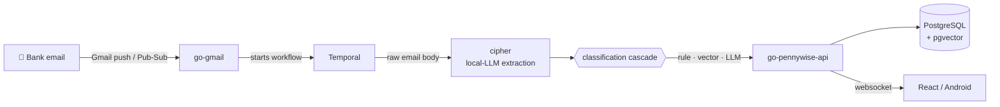

# Pennywise

Live Demo: [dev.pennywise.cloud](https://dev.pennywise.cloud)

**A self-hosted personal finance app that reads your bank emails and turns them into a clean, categorized budget — automatically, using AI that runs on your own hardware.**


Indian banking produces chaotic transaction data: the same merchant shows up as `PYU*Swiggy`, `Razorpay*Swiggy`, or a bare UPI handle depending on the payment gateway, and every bank formats its alert emails differently. Pennywise tames that chaos end-to-end — a bank email arrives and seconds later a correctly named, correctly categorized transaction lands in your YNAB-style budget. No bank credentials, no screen scraping, no manual entry.

## Highlights

- **Zero-touch capture** — a Gmail watcher picks up bank alert emails via Pub/Sub push and feeds them through a durable Temporal workflow. No polling, no missed transactions; failed runs can be retried or nudged with a signal.
- **Local-first AI extraction** — a small language model (Gemma via Ollama, JSON mode, temperature 0) reads the raw email and pulls out merchant, amount, and account. It survives template changes, forex traps, and grammatical debris that killed the old regex parser.
- **Four-phase classification cascade** — rules first, semantic memory second, LLM reasoning last. Most transactions never need the expensive path.
- **It learns from you** — every correction you make becomes a payee rule or a vector embedding, so the same transaction is classified instantly next time.
- **A budget agent you can talk to** — ask questions about your money in plain language; the agent inspects the schema, runs validated read-only SQL against your budget, and streams its answer live over websockets.
- **Real envelope budgeting** — monthly category budgets with carryover, accounts, payees, tags, loans, reports, and a dashboard. Web (React 19), Android (Expo), and a legacy Angular client.
- **Self-hosted and private** — runs on your own box with Docker Compose. Extraction, embeddings, and classification all default to local models; cloud LLM providers (OpenAI/Anthropic/OpenRouter) are optional and bring-your-own-key.

## How a transaction is born



A real alert goes in:

> `Alert: You've spent USD 12.00 on your CC XX1111 at GITHUB INC... equivalent INR is Rs. 1024.50.`

and a transaction comes out:

> **GitHub** · Subscriptions · ₹1,024.50 · HDFC 1111

The extractor resolved the forex trap (₹1,024.50, not $12.00), truncated the masked card number, and normalized the merchant — no string manipulation code involved.

## The classification cascade

Cipher (the AI service) classifies every extracted transaction through a strict cascade, cheapest first:

| Phase | Engine | What happens |
|-------|--------|--------------|
| 1. Extraction | Local SLM (Ollama, JSON mode) | Merchant, amount, and account pulled from raw email text |
| 2. Payee rules | PostgreSQL | `EXACT` then `PATTERN` match on merchant/UPI handle — instant, ~5 ms, 100% confidence |
| 3. Vector memory | pgvector + `bge-m3` embeddings | Hybrid search over your past transactions: cosine similarity plus an amount-difference penalty to kill false positives |
| 4. LLM fallback | Pluggable LLM (local Ollama by default) | Full classification with reasoning; the result is embedded so Phase 3 catches it next time |

Every prediction is recorded with its source (`RULE` / `VECTOR` / `LLM` / `MANUAL`), confidence, and any later user correction — so the pipeline's accuracy is measurable, and corrections feed straight back into the vector memory as ground truth.

The details (schemas, thresholds, the "Megamart problem" of super-apps spanning categories) are in [docs/cipher.md](docs/cipher.md).

## Supported banks

| Bank | Status | Alert types exercised |
|------|--------|-----------------------|
| HDFC Bank | ✅ Tested end-to-end | UPI debits/credits (VPA), credit-card spends, forex transactions, e-mandate/auto-pay confirmations, InstaAlert notifications |
| Others | Untested | Should extract cleanly — see below |

There are no per-bank templates or keyword filters in the pipeline: every new email is handed to the extraction LLM, and whatever comes back without an amount, account, and date is discarded as "not a transaction". So alert emails from other banks are expected to work with zero new code — at most, the few-shot examples in the extraction prompt (`ExtractionPrompt` in `backend/cipher/internal/client/ollama.go`) may need a nudge for an unusual template. If you try another bank, open an issue with a redacted sample email.

## Ask your budget anything

Cipher also hosts a budget agent with typed tools: it can fetch your budget summary, read the database schema, and execute validated read-only SQL (single `SELECT`/`WITH` statements only, budget-scoped) — then stream its reasoning and answer token-by-token through Redis into the API's budget-scoped websocket hub, rendered live in the frontend.

The agent's LLM provider is configurable per user in Settings → AI Configuration: local Ollama, OpenAI, Anthropic, or OpenRouter with your own API key.

## Services

| Service | Path | Status | Role |
|---------|------|--------|------|
| Go API | [`backend/go-pennywise-api`](backend/go-pennywise-api/README.md) | Active | REST API: auth, budgets, transactions, reports, websocket fanout |
| Cipher | [`backend/cipher`](backend/cipher/README.md) | Active | AI extraction + classification pipeline, budget agent runtime |
| Gmail watcher | [`backend/go-gmail`](backend/go-gmail/README.md) | Active | Gmail Pub/Sub ingestion, starts Temporal workflows |
| Temporal workflows | [`backend/workflows`](backend/workflows/README.md) | Active | Durable email → transaction workflow definitions + worker |
| Shared Go module | [`backend/shared`](backend/shared/README.md) | Active | Repositories, models, transport, internal auth, observability |
| React frontend | [`react-frontend`](react-frontend/README.md) | Active development | Main web app |
| Android app | [`android-frontend`](android-frontend/README.md) | Active development | Expo React Native client |
| Angular frontend | [`frontend`](frontend/README.md) | Legacy/maintenance | Older web app |
| Python MLP | [`backend/python-mlp`](backend/python-mlp/README.md) | Deprecated | Former prediction service, replaced by Cipher |
| File parser | [`backend/file-parser`](backend/file-parser/README.md) | Experimental | Clojure scaffold for bulk uploads |

Architectural notes worth knowing: `cipher` and the API share a Go repository package instead of chattering over HTTP, so classification reads are sub-millisecond; service-to-service calls carry correlation/caller/origin headers plus a shared internal token, propagated through Temporal workflow hops. See [AGENTS.md](AGENTS.md) for the full map.

## Quick start

**Prerequisites:** Docker + Docker Compose, and [Ollama](https://ollama.com) on the host for local AI.

```bash
git clone git@github.com:Rishabh-Kapri/pennywise.git && cd pennywise
git config core.hooksPath .githooks   # auto-vendors Go modules on commit
docker compose up --build
```

The compose stack brings up PostgreSQL (with pgvector), Redis, Temporal + its UI, migrations, the Go API, Gmail watcher, Cipher, and the workflows worker. Ollama is intentionally not in the stack — run `ollama serve` on the host and keep `OLLAMA_URL=http://host.docker.internal:11434` (or point it anywhere reachable).

Copy `.env.example` to `.env` only when you need to override defaults or add real Google/OAuth/LLM credentials.

### Try it without a Google account

Set `DEMO_MODE=true` on the API and `VITE_DEMO_MODE=true` on the React frontend, then click **Try Demo** on the login page. The first demo login seeds a persistent demo user with a full budget: accounts, categories, ~4 months of transactions, payee rules, and AI predictions across every pipeline source.

```bash
cd react-frontend && npm install && npm run dev   # web app on :5173
```

## Development

| Component | Build | Test |
|-----------|-------|------|
| Go API | `go build ./cmd/api` | `go test ./...` |
| Go Gmail | `go build ./cmd` | `go test ./...` |
| Cipher | `go build ./cmd/api` | `go test ./...` |
| Workflows | `go build ./cmd/worker` | `go test ./...` |
| Shared | — | `go test ./...` |
| React frontend | `npm run build` | `npm run lint` (no test suite) |
| Angular frontend | `npm run build` | `npm test` |

All Go commands run from the respective `backend/<service>` directory; each has a `Makefile` with `run`/`build`/`test`/`check`/`vendor` aliases.

### Database migrations

```bash
cd backend/go-pennywise-api
go run ./cmd/migrations -dir . up
go run ./cmd/migrations -dir . status
```

On a **fresh database**: `CREATE EXTENSION vector` first, then `up` → `baseline` → `up` (the legacy Go seed migrations 00002/00003 fail on empty databases; `baseline` marks them applied).

### Ports

| Service | Port |
|---------|------|
| Go API | `5151` |
| Cipher | `5160` |
| Go Gmail | `5170` |
| Temporal UI | `8233` |
| React dev | `5173` |
| Angular dev | `5000` |

## Documentation

- [AGENTS.md](AGENTS.md) — full service map, auth flow, caveats
- [docs/cipher.md](docs/cipher.md) — the classification pipeline: schemas, thresholds, and the engineering pivots behind it
- [docs/agent-architecture.md](docs/agent-architecture.md) — budget agent runtime design
- [docs/observability.md](docs/observability.md) — OTel, logging, metrics
- [docs/transport-architecture.md](docs/transport-architecture.md) — inter-service transport layer
- [docs/](docs/README.md) — everything else
